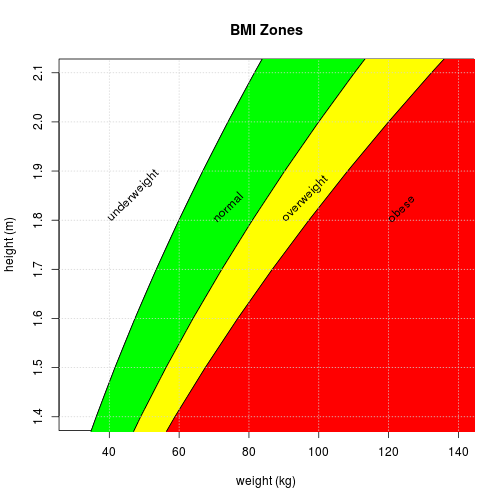

## What is BMI?

The [body mass index (BMI)] (http://en.wikipedia.org/wiki/Body_mass_index) is a measure of relative weight based on an individual's mass and height.

The BMI is usually used as a simple method to assess how much an individual's body weight departs from what is normal or desirable for a person of his or her height.

---

## Calculating BMI

BMI is defined as the individual's body mass divided by the square of their height – with the value universally being given in units of kg/m2.

 
$$BMI = \frac{mass(kg)}{(height(m))^2}$$

---
### A graph of body mass index as a function of body mass and body height.
 

---

## Body Mass Index Calculator
You may use [Body Mass Index Calculator] (http://grdshch.shinyapps.io/bmic) application for convenient getting your BMI and finding out what weight you need to be in a BMI zone you desire.

